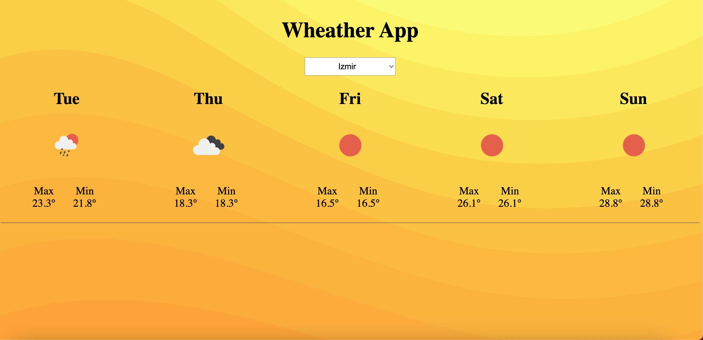

Weather App is a web application built using React.js and demonstrates the usage of the useContext hook. It allows users to select a city and view the current weather conditions for that location.

Features:

Select any city and view its weather information instantly.
Displays the current temperature, weather description, humidity, and wind speed.
Simple and intuitive user interface.
Technologies Used:

React.js
useContext hook

Contributing:

Contributions to the Weather App project are welcome. If you find any issues or have suggestions for improvement, please open an issue or submit a pull request on the GitHub repository.

## :computer: Project Setup

1. Git clone / download the project
2. npm install
3. new terminal+ cd server -- npm start
4. new terminal+ cd client -- npm start

## :phone: To Contact

 

   
<b> <samp>To Contact </samp></b>

    
   <samp>
   <b><h2 style="color: #fc6203">Onur &nbsp; Hakan &nbsp; PESENER</h2></b>
   
      
      
      
     LinkedIn: <a href="https://www.linkedin.com/in/hakan-p-2713b576/"> LinkedIn Account</a>
      
     Instagram: <a href="https://www.instagram.com/hakanpesener/"> Instagram Account</a>
      
      
     Mail Adress: <a href="#"> hakanpesener@gmail.com</a>
   </samp>
 

